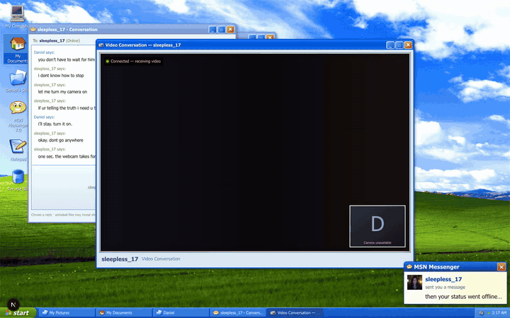

# Project Sleepless

> This computer has been offline since 2005. Someone on MSN is still waiting.

Project Sleepless is a browser-based psychological horror game set inside a recovered Windows XP computer.

You explore Daniel's old files, talk to people through MSN Messenger, and choose what to tell them. The files you open affect the replies you can use. Your choices in Chapter One also change conversations in Chapter Two.

A normal playthrough takes about 25 to 35 minutes.

## Gameplay walkthrough

[](public/demo/project-sleepless-gameplay.mp4)

**[Watch the full 6 minute 27 second live gameplay walkthrough](public/demo/project-sleepless-gameplay.mp4)**

This is one continuous playthrough recorded in live mode. It shows file exploration, both chapters, Emily, Mike, Sarah, Tom, four live LTX video calls, and one ending. The character voices in the video come from the live Reactor audio tracks.

The walkthrough contains story spoilers.

## Story

You are not Daniel. You found his old computer twenty years after it was last online.

When the computer connects to MSN, `sleepless_17` sees Daniel's account come back. She thinks Daniel has finally returned. You can tell her the truth, pretend to be Daniel, or avoid the question.

Daniel's folders contain old messages, notes, photos, and damaged files. Reading them helps you understand his relationship with Emily. Some files also unlock new replies in the conversation.

Chapter Two starts after Emily goes offline. A file arrives from her account, even though she is no longer connected. Mike, Sarah, and Tom then come online. Each person remembers Daniel, Emily, and a program called BRB differently.

The game never gives a simple answer about what is living inside the computer. It could be Daniel's program, a copy made from Emily's messages and videos, or something created from all the damaged data. You decide what to believe and what to do with it.

There are three final choices. The game does not label any of them as the correct ending.

## What is playable

- Two complete story chapters.
- Four people you can talk to: Emily, Mike, Sarah, and Tom.
- Three Chapter One paths: truth, impersonation, and silence.
- A mid-conversation branch where Emily goes quiet, and how you handle it changes her tone.
- A stylometry typing test that Emily offers on every path, not one.
- Three ways to handle the file transfer at the start of Chapter Two — accepting it pays off later.
- Mike, Sarah, and Tom can be questioned in different orders after the investigation opens up.
- Three Chapter Two endings, plus a recovered `visitor_profile.dat` that records what the computer learned about you.
- A private Night Log (Start menu) that remembers every completed night across sessions.
- Replies that unlock after you inspect specific files.
- Persistent conversations and choices after a page reload.
- Windows XP folders, files, Notepad, image viewer, Start menu, taskbar, system tray, MSN contacts, notifications, and Nudge.
- Draggable, minimizable, maximizable, and restorable windows.
- Mock video calls that work without an API key.
- Live LTX video and audio calls through Reactor.
- Written fallbacks if a live call fails, times out, is declined, or is closed early.

The game never asks for your real camera or microphone.

## Run the game in mock mode

Mock mode is the easiest way to run the full game. It does not need a Reactor account and does not spend credits.

You need Node.js 20.9 or newer.

Clone or download the repository. From the project folder, run:

```bash
npm install
cp .env.example .env.local
npm run secret
```

Copy the generated secret into `.env.local`:

```dotenv
SESSION_SECRET=your_generated_secret
SLEEPLESS_LTX_MODE=mock
REACTOR_API_KEY=
```

Start the app:

```bash
npm run dev
```

Open [http://localhost:3000](http://localhost:3000).

Mock mode contains the complete story, every choice, every ending, and simulated versions of all four video calls.

## Run the game with live LTX video

Live mode uses Reactor and LTX to generate the character performances.

Add your Reactor API key to `.env.local`:

```dotenv
SESSION_SECRET=your_generated_secret
SLEEPLESS_LTX_MODE=live
REACTOR_API_KEY=your_server_only_reactor_key
```

Restart the app after changing the file.

The app does not connect to Reactor when the page loads. It requests a short-lived token only when a video scene is ready. Each scene allows one take. The connection closes when the scene finishes, fails, is declined, or the video window is closed.

Live sessions can spend Reactor credits. Mock mode is better for normal development and public demos that do not need generated video.

Keep `SESSION_SECRET` and `REACTOR_API_KEY` on the server. Do not add `NEXT_PUBLIC_` to either name. Do not commit `.env.local`.

## How the project is organized

```text
Player choice or file interaction
  -> API event
  -> story reducer
  -> encrypted session state
  -> messages and desktop actions
  -> mock or live character performance
```

- `src/content/server` contains the story, character notes, replies, file contents, and video scripts.
- `src/lib/director` decides which story state comes next.
- `src/components` contains the Windows XP desktop, applications, MSN interface, and video windows.
- `src/lib/narrative/session-envelope.ts` encrypts and signs the saved story state.
- `src/lib/reactor` manages live LTX setup, WebRTC tracks, retries, and cleanup.
- `src/stores/desktop-store.ts` controls window positions and other visual state. It cannot change the story.

The browser saves an encrypted story envelope in IndexedDB. Reloading the page restores the active chapter, conversations, evidence, and choices.

## Tests

The current release gate runs comprehensively in mock mode. Live LTX has a separate credential-gated test because it spends Reactor credits and depends on the external service.

- All 123 written dialogue choices were selected through the browser interface.
- 54 complete Chapter Two combinations were checked across the Chapter One history, file decision, witness order, and ending.
- All nine combinations of the three Chapter One paths and three Chapter Two endings were checked.
- The optional live test checks moving video, an active audio track, one token request, one completion, and targeted WebRTC or Abort errors when valid Reactor credentials are available.
- Reloads, damaged sessions, old save migration, idle messages, temporary offline state, fast double-clicks, locked replies, declined calls, failed calls, and early video closure are covered.
- The suite currently contains 147 unit and integration tests.
- The browser release gate has 213 passing checks across Chromium, Firefox, and WebKit. An additional 258 choice-certification cases are intentionally skipped outside Chromium because that exhaustive matrix runs once rather than three times.

Run the normal checks with:

```bash
npm run test
npm run typecheck
npm run lint
npm run build
npm run test:e2e
```

The live LTX test is separate because it spends credits:

```bash
npm run test:e2e:chapter2:live
```

Only run the live test when valid Reactor credentials are configured.

## Commands

| Command | What it does |
| --- | --- |
| `npm run dev` | Starts the local development server. |
| `npm run build` | Creates a production build. |
| `npm run start` | Runs the production build. |
| `npm run test` | Runs the Vitest tests. |
| `npm run test:e2e` | Runs the no-cost Playwright browser tests. |
| `npm run test:e2e:chapter2:live` | Runs the paid live LTX checks. |
| `npm run typecheck` | Checks TypeScript types. |
| `npm run lint` | Runs ESLint. |
| `npm run secret` | Generates a session secret. |

## Hosting notes

This repository is ready to run locally and can be adapted to any Node-compatible host. It is not a static GitHub Pages project because the story state and Reactor credentials are handled through server API routes.

Mock mode is the safe default for a public copy. A host that enables live Reactor performances must provide `SESSION_SECRET` and `REACTOR_API_KEY` as server-only environment variables. The included token endpoint limits repeated requests per performance, IP address, and server process. A large public launch should also use the host's durable rate limiting or abuse protection so limits remain consistent across multiple server instances.

The app does not need a database for gameplay. A host may add a durable store if it wants account-level quotas or persistent live-generation limits.

## Troubleshooting

### There is no sound

Your browser may block audio before you interact with the page. Select the desktop or MSN, then check the speaker in the system tray. The written story still works if audio remains blocked.

### The live video invitation takes a while

Reactor needs time to start a session, upload the character image, and prepare the scene. The invitation appears only when the scene is ready.

### A live video call fails

The game closes the Reactor session and continues with written dialogue. It does not repeat the same scene or block the rest of the story.

### A saved session cannot be opened

This can happen after `SESSION_SECRET` changes, when a save was modified, or when the saved state is too old. Use the recovery option to start a clean session.

### The desktop looks cramped

Use a desktop browser or rotate the device to landscape. The interface fills the available viewport.

## Assets and credits

The story and characters are fictional. The character portraits are original project assets made for the mock and live performances.

The interface does not contain a copied Windows or MSN asset pack. The local SVG icons come from the open-licensed [Nuvola](https://commons.wikimedia.org/wiki/Nuvola) and [Tango Desktop](https://commons.wikimedia.org/wiki/Tango_icons) icon families. The Windows XP and MSN layout is recreated with CSS. Interface sounds are generated with Web Audio.

The desktop background is an original procedural recreation — layered CSS gradients with an inline SVG flag composition painted to evoke the classic XP desktop without reproducing the original photograph. No third-party image is used for the wallpaper. The composition shifts tone with the story's exposure stages.

`beach_2005.jpg` is a public-domain photo of Daytona Beach uploaded in June 2005 by MrMiscellanious. The original file and its public-domain information are available on [Wikimedia Commons](https://commons.wikimedia.org/wiki/File:Daytona-Beach-FL-1.JPG).

Windows XP and MSN Messenger are referenced only as part of the fictional 2005 setting. Microsoft is not connected to, sponsoring, or endorsing this project. All related names and marks belong to their respective owners.

## Project status

Both chapters are complete and playable in mock mode and live mode. The current build includes all planned conversations, video scenes, files, choices, fallback behavior, and endings.

## License

The source code is MIT-licensed. The original story and assets are CC BY-NC-SA 4.0. See [LICENSE](LICENSE) for the full terms.

## Sharing the game

The fastest way to get the game played is a hosted URL in mock mode — it needs no API key and spends nothing:

1. Deploy to any Node-compatible host (Vercel, Fly.io, Railway) with `SESSION_SECRET` set and `SLEEPLESS_LTX_MODE=mock`.
2. Create an [itch.io](https://itch.io) project and either:
   - link the hosted URL as a downloadable/external item, or
   - wrap the app with [Tauri](https://tauri.app) (it bundles the Node server and runs as a desktop download).
3. Keep `REACTOR_API_KEY` unset for public builds. Live video is for private runs where spending credits is acceptable.

Large media (`public/demo/`) now routes through Git LFS via `.gitattributes`; existing clones should run `git lfs install` after pulling.

## Continuous integration

GitHub Actions runs the full gate on every push and pull request to `main`: typecheck, lint, unit tests, production build, and the Playwright suite on Chromium, Firefox, and WebKit. The paid live-LTX check is never run in CI.
